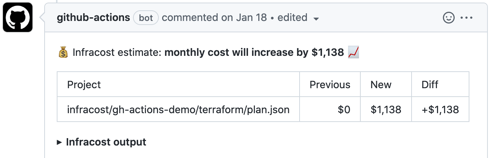
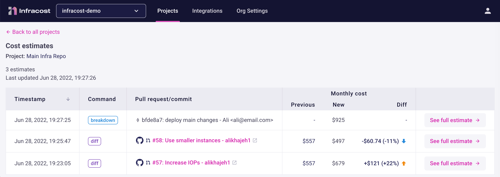
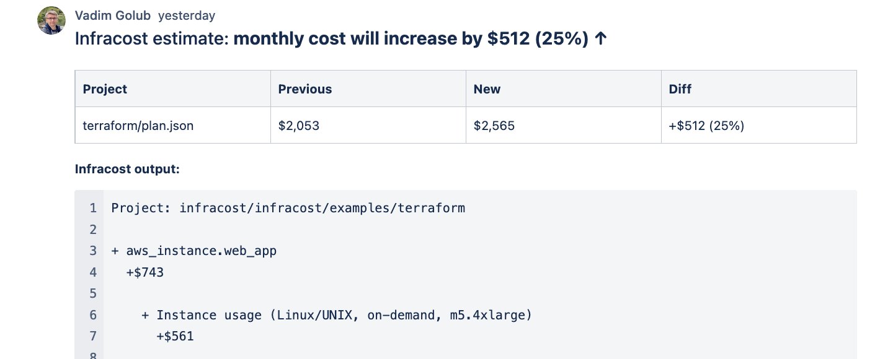

# Infracost CircleCI

This project provides instructions for using Infracost in a CircleCI pipeline, it works with both GitHub and Bitbucket Cloud. This enables you to see cloud cost estimates for Terraform in pull requests. 💰

## Table of contents

* [GitHub Quick start](#github-quick-start)
* [Bitbucket Quick start](#bitbucket-cloud-quick-start)
* [Comment options](#comment-options)
* [Examples](#examples)
* [Contributing](#contributing)
* [License](#license)

## GitHub Quick start


1. If you haven't done so already, [download Infracost](https://www.infracost.io/docs/#quick-start) and run `infracost auth login` to get a free API key.

2. Retrieve your Infracost API key by running `infracost configure get api_key`.

3. In CircleCI, go to your Project Settings > Environment Variables, and add environment variables for `INFRACOST_API_KEY`, `GITHUB_TOKEN`.

4. We recommend you enable CircleCI's "Only build pull requests" option. This setting is in CircleCI's Project > Advanced settings page.

5. Create a new file at `.circleci/config.yml` in your repo with the following content.

    ```yml
    version: 2.1

    jobs:
      infracost:
        # Always use the latest 0.10.x version to pick up bug fixes and new resources.
        # See https://www.infracost.io/docs/integrations/cicd/#docker-images for other options
        docker:
          - image: infracost/infracost:ci-0.10
        environment:
          TF_ROOT: terraform # Update this to be your the path to your terraform code!
          # IMPORTANT: update this to your target branch, e.g. main, master
          BASE_BRANCH: main
          # If you use private modules you'll need this env variable to use
          # the same ssh-agent socket value across all jobs & steps.
          SSH_AUTH_SOCK: /tmp/ssh_agent.sock
          # If you're using Terraform Cloud/Enterprise and have variables or private modules stored
          # on there, specify the following to automatically retrieve the variables:
          # INFRACOST_TERRAFORM_CLOUD_TOKEN: $TFC_TOKEN
          # INFRACOST_TERRAFORM_CLOUD_HOST: app.terraform.io # Change this if you're using Terraform Enterprise
   
        steps:
          - run:
              name: Skip if not pull request
              command: |
                if [ "$CIRCLE_PULL_REQUEST" == "" ]; then
                  circleci step halt
                fi
          - attach_workspace:
              at: /tmp
          - checkout
          # Clone the base branch of the pull request (e.g. main/master) into a temp directory.
          - run:
              name: Checkout base branch
              command: git clone $CIRCLE_REPOSITORY_URL --branch=$BASE_BRANCH --single-branch /tmp/base
   
          # If you use private modules, add an environment variable or secret
          # called GIT_SSH_KEY with your private key, so Infracost can access
          # private repositories (similar to how Terraform/Terragrunt does).
          # - run:
          #     name: add git ssh key
          #     command: | 
          #       ssh-agent -a ${SSH_AUTH_SOCK}
          #       mkdir -p ~/.ssh
          #       echo "${GIT_SSH_KEY}" | tr -d '\r' | ssh-add -
          #       # Update this to github.com, gitlab.com, bitbucket.org, ssh.dev.azure.com or your source control server's domain
          #       ssh-keyscan github.com >> ~/.ssh/known_hosts
   
          # Generate Infracost JSON file as the baseline.
          - run:
              name: Generate Infracost cost estimate baseline
              command: |
                  infracost breakdown --path=${TF_ROOT} \
                                      --format=json \
                                      --out-file=/tmp/infracost-base.json
          # Generate an Infracost diff and save it to a JSON file.
          - run:
              name: Generate Infracost cost estimate baseline
              command: |
                  infracost diff --path=${TF_ROOT} \
                                --format=json \
                                --compare-to=/tmp/infracost-base.json \
                                --out-file=/tmp/infracost.json
          # Posts a comment to the PR using the 'update' behavior.
          # This creates a single comment and updates it. The "quietest" option.
          # The other valid behaviors are:
          #   delete-and-new - Delete previous comments and create a new one.
          #   hide-and-new - Minimize previous comments and create a new one.
          #   new - Create a new cost estimate comment on every push.
          # See https://www.infracost.io/docs/features/cli_commands/#comment-on-pull-requests for other options.
          # The INFRACOST_ENABLE_CLOUD​=true section instructs the CLI to send its JSON output to Infracost Cloud.
          #   This SaaS product gives you visibility across all changes in a dashboard. The JSON output does not
          #   contain any cloud credentials or secrets.
          - run:
              name: Post Infracost comment
              command: |
                  # Extract the PR number from the PR URL
                  PULL_REQUEST_NUMBER=${CIRCLE_PULL_REQUEST##*/}
                  INFRACOST_ENABLE_CLOUD​=true infracost comment github --path=/tmp/infracost.json \
                                                                        --repo=$CIRCLE_PROJECT_USERNAME/$CIRCLE_PROJECT_REPONAME \
                                                                        --pull-request=$PULL_REQUEST_NUMBER \
                                                                        --github-token=$GITHUB_TOKEN \
                                                                        --behavior=update
    workflows:
      infracost:
        jobs:
          - infracost
    ```

6. 🎉 That's it! Send a new pull request to change something in Terraform that costs money. You should see a pull request comment that gets updated, e.g. the 📉 and 📈 emojis will update as changes are pushed!

   If there are issues, check the GitHub Actions logs and [this page](https://www.infracost.io/docs/troubleshooting/).

    

7. To see the test pull request costs in Infracost Cloud, [log in](https://dashboard.infracost.io/) > switch to your organization > Projects. To learn more, see [our docs](https://www.infracost.io/docs/infracost_cloud/get_started/).

    

8. Follow [the docs](https://www.infracost.io/usage-file) if you'd also like to show cost for of usage-based resources such as AWS Lambda or S3. The usage for these resources are fetched from CloudWatch/cloud APIs and used to calculate an estimate.

## Bitbucket Cloud Quick start


1. If you haven't done so already, [download Infracost](https://www.infracost.io/docs/#quick-start) and run `infracost auth login` to get a free API key.

2. Retrieve your Infracost API key by running `infracost configure get api_key`.

3. In CircleCI, go to your Project Settings > Environment Variables, and add environment variables for `INFRACOST_API_KEY`, `BITBUCKET_TOKEN`.

4. We recommend you enable CircleCI's "Only build pull requests" option. This setting is in CircleCI's Project > Advanced settings page.

5. Create a new file at `.circleci/config.yml` in your repo with the following content.

    ```yml
    version: 2.1

    jobs:
      infracost:
        # Always use the latest 0.10.x version to pick up bug fixes and new resources.
        # See https://www.infracost.io/docs/integrations/cicd/#docker-images for other options
        docker:
          - image: infracost/infracost:ci-0.10
        environment:
          TF_ROOT: terraform # Update this to be your the path to your terraform code!
          # IMPORTANT: update this to your target branch, e.g. main, master
          BASE_BRANCH: main
          # If you use private modules you'll need this env variable to use
          # the same ssh-agent socket value across all jobs & steps.
          SSH_AUTH_SOCK: /tmp/ssh_agent.sock
          # If you're using Terraform Cloud/Enterprise and have variables or private modules stored
          # on there, specify the following to automatically retrieve the variables:
          # INFRACOST_TERRAFORM_CLOUD_TOKEN: $TFC_TOKEN
          # INFRACOST_TERRAFORM_CLOUD_HOST: app.terraform.io # Change this if you're using Terraform Enterprise
        steps:
          - run:
              name: Skip if not pull request
              command: |
                if [ "$CIRCLE_PULL_REQUEST" == "" ]; then
                  circleci step halt
                fi
          - attach_workspace:
              at: /tmp
          - checkout
          # Clone the base branch of the pull request (e.g. main/master) into a temp directory.
          - run:
              name: Checkout base branch
              command: git clone $CIRCLE_REPOSITORY_URL --branch=$BASE_BRANCH --single-branch /tmp/base
   
          # If you use private modules, add an environment variable or secret
          # called GIT_SSH_KEY with your private key, so Infracost can access
          # private repositories (similar to how Terraform/Terragrunt does).
          # - run:
          #     name: add git ssh key
          #     command: | 
          #       ssh-agent -a ${SSH_AUTH_SOCK}
          #       mkdir -p ~/.ssh
          #       echo "${GIT_SSH_KEY}" | tr -d '\r' | ssh-add -
          #       # Update this to github.com, gitlab.com, bitbucket.org, ssh.dev.azure.com or your source control server's domain
          #       ssh-keyscan bitbucket.org >> ~/.ssh/known_hosts
   
          # Generate Infracost JSON file as the baseline.
          - run:
              name: Generate Infracost cost estimate baseline
              command: |
                  infracost breakdown --path=${TF_ROOT} \
                                      --format=json \
                                      --out-file=/tmp/infracost-base.json
          # Generate an Infracost diff and save it to a JSON file.
          - run:
              name: Generate Infracost cost estimate baseline
              command: |
                  infracost diff --path=${TF_ROOT} \
                                --format=json \
                                --compare-to=/tmp/infracost-base.json \
                                --out-file=/tmp/infracost.json
          # Posts a comment to the PR using the 'update' behavior.
          # This creates a single comment and updates it. The "quietest" option.
          # The other valid behaviors are:
          #   delete-and-new - Delete previous comments and create a new one.
          #   new - Create a new cost estimate comment on every push.
          # See https://www.infracost.io/docs/features/cli_commands/#comment-on-pull-requests for other options.
          # The INFRACOST_ENABLE_CLOUD​=true section instructs the CLI to send its JSON output to Infracost Cloud.
          #   This SaaS product gives you visibility across all changes in a dashboard. The JSON output does not
          #   contain any cloud credentials or secrets.
          - run:
              name: Post Infracost comment
              command: |
                  # Extract the PR number from the PR URL
                  PULL_REQUEST_NUMBER=$(echo "$CIRCLE_PULL_REQUEST" | sed 's/.*pull-requests\///')
                  INFRACOST_ENABLE_CLOUD​=true infracost comment bitbucket --path=/tmp/infracost.json \
                                                                           --repo=$CIRCLE_PROJECT_USERNAME/$CIRCLE_PROJECT_REPONAME \
                                                                            --pull-request=$PULL_REQUEST_NUMBER \
                                                                            --bitbucket-token $BITBUCKET_TOKEN \
                                                                            --behavior=update
    workflows:
      infracost:
        jobs:
          - infracost
    ```

6. 🎉 That's it! Send a new pull request to change something in Terraform that costs money. You should see a pull request comment that gets updated, e.g. the '↑' and '↓' characters will update as changes are pushed!

    

7. To see the test pull request costs in Infracost Cloud, [log in](https://dashboard.infracost.io/) > switch to your organization > Projects. To learn more, see [our docs](https://www.infracost.io/docs/infracost_cloud/get_started/).

   

8. Follow [the docs](https://www.infracost.io/usage-file) if you'd also like to show cost for of usage-based resources such as AWS Lambda or S3. The usage for these resources are fetched from CloudWatch/cloud APIs and used to calculate an estimate.

## Comment options

Run `infracost comment github --help` or `infracost comment bitbucket --help` to see the the full list of options or [see our docs](https://www.infracost.io/docs/features/cli_commands#comment-on-pull-requests).

## Examples

We don't yet have examples for different use cases with Infracost for CircleCI, but we do have a selection of [examples for GitLab](https://gitlab.com/infracost/infracost-gitlab-ci/-/tree/master/examples#examples) that can be modified to work with CircleCI.

## Contributing

Issues and pull requests are welcome. Please create issues in [this repo](https://github.com/infracost/infracost) or [join our community Slack slack](https://www.infracost.io/community-chat), we are a friendly bunch and happy to help you get started :)

## License

[Apache License 2.0](https://choosealicense.com/licenses/apache-2.0/)
